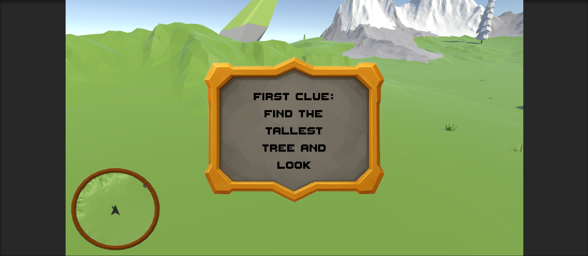
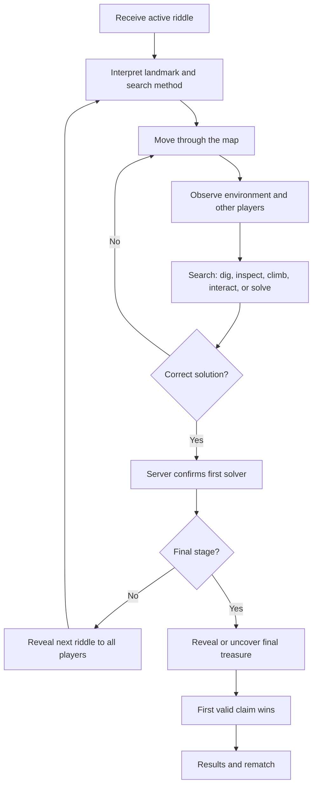
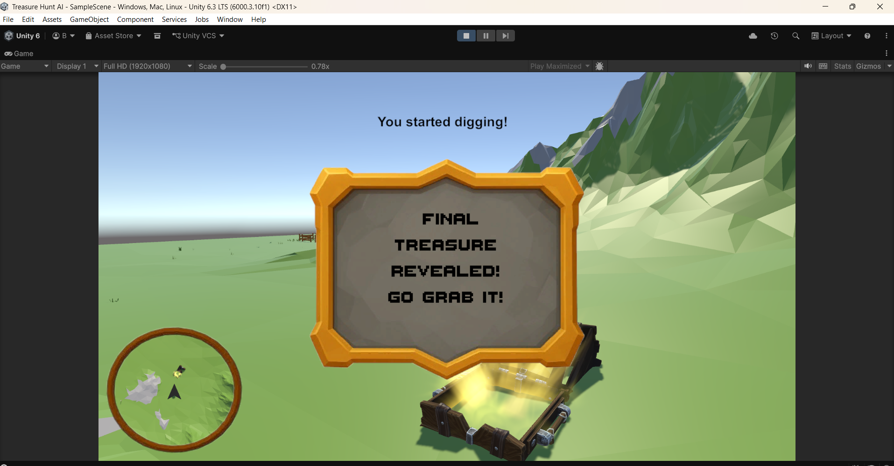

# Game Design Document

## 1. Document status

**Project:** Treasure Hunt  
**Working genre:** Competitive social multiplayer / environmental puzzle race  
**Engine:** Unity 6.3 LTS  
**Target platform:** PC first  
**Target players:** 4–8 players per match  
**Prototype minimum:** 2 players  
**Camera:** First-person  
**Business model:** Small premium game; exact price decided after testing  
**Document version:** 0.1

---

## 2. High concept

Every player begins with the same riddle. The riddle points toward a landmark, hiding place, environmental interaction, or dig location somewhere on the map. Players interpret the clue, watch one another, search the world, and race to solve it.

The first player to solve the active clue advances the hunt globally. Every player then receives the next riddle. After several stages, the final riddle leads to the treasure. The first player to uncover and claim the final treasure wins.

A match never uses one permanent route. At the beginning of each round, the host or server selects a valid sequence from many handcrafted clue locations. Each selected location can also use different riddle wording. Players can learn the map, but they cannot memorize one fixed solution path.

### One-sentence pitch

> A competitive multiplayer treasure hunt where solving each riddle moves the entire match forward, while the route and hiding places change every round.

### Player fantasy

- Read a mysterious clue.
- Recognize or discover the landmark it describes.
- Search more intelligently than the other players.
- Notice when another player has understood something.
- Mislead followers by checking false locations.
- Be the person who reveals the next stage.
- Win the final scramble for the treasure.

---

## 3. Design pillars

### 3.1 Read the world, not the HUD

The environment must provide the information. The final game should not show:

- Distance to the active clue
- A waypoint over the solution
- A minimap icon for the hidden target
- “Press E to collect clue” before discovery
- A glowing trail leading to the answer

The riddle, landmarks, player observation, and search actions are the guidance.

### 3.2 Shared progress, personal victory

The first player to solve a clue advances the hunt for everyone. Nobody is eliminated and nobody becomes permanently stuck on an old stage. The final treasure still has one winner.

### 3.3 Different hunt every match

The terrain remains handcrafted, but each match changes:

- Selected clue locations
- Route order
- Riddle variants
- Search methods
- Final treasure location

The route is randomized from authored content rather than placing targets at meaningless random coordinates.

### 3.4 Variety in searching

Not every clue is buried. Possible solution methods include:

- Digging at an interpreted location
- Finding an object in a tree hollow
- Looking under or behind a landmark
- Climbing to a hidden ledge
- Activating an environmental object
- Completing a small local puzzle
- Observing direction, shadow, shape, or arrangement

### 3.5 Players create the social tension

The game should generate moments such as:

- Following someone who appears confident
- Pretending to search the wrong landmark
- Several players digging around the same tree
- A player correctly finding the area but searching the wrong side
- The whole group suddenly sprinting when a clue is solved
- A final treasure steal during another player’s digging attempt

---

## 4. Target experience

### Match length

**Initial target:** 8–15 minutes.

The game should be quick enough for repeated rounds but long enough for several reversals.

### Round structure

Recommended initial structure:

1. Lobby and ready check
2. Match countdown
3. First riddle shown to every player
4. Three intermediate clue stages
5. Final treasure riddle
6. Treasure discovery and claim
7. Winner screen and round summary
8. Rematch vote

### Match emotional arc

1. **Orientation:** Everyone reads the same clue.
2. **Separation:** Players interpret it differently and spread out.
3. **Suspicion:** Players notice where others are searching.
4. **Convergence:** Several players gather near a likely solution.
5. **Breakthrough:** One player solves the clue.
6. **Reset and race:** The next clue appears globally.
7. **Escalation:** The group becomes more aggressive and observant.
8. **Final scramble:** The last clue triggers the fastest and most chaotic search.
9. **Payoff:** One player claims the treasure.

---

## 5. Core gameplay loop

---

## 6. Clue system

### 6.1 Clue definition

A clue is an authored content record that connects:

- Riddle text
- Target location
- Search method
- Difficulty
- Region
- Allowed stage
- Optional hint
- Completion conditions

### 6.2 Search methods

#### Dig

The player can use the shovel on any valid ground surface. Wrong locations still produce animation, particles, sound, and a temporary hole visual. Correct digging contributes toward discovery progress inside a hidden validation zone.

The first implementation should simulate holes visually rather than deforming the complete terrain mesh.

#### Inspect

The player searches an environmental hiding place, such as:

- Tree hollow
- Broken barrel
- Under a bridge
- Behind a statue
- Inside a ruined wall
- Beneath loose boards

The target should not advertise itself before the player is close and looking at it.

#### Climb

The answer is located on:

- Tree branch
- Roof
- Tower
- Cliff shelf
- Bridge beam

Climbing must remain simple and reliable. The game is not a precision platformer.

#### Interact

The solution requires an environmental action, such as:

- Ringing the correct bell
- Turning a statue
- Pulling a hidden lever
- Lighting a torch
- Opening a concealed panel

#### Local puzzle

A short puzzle tied to one landmark, such as:

- Activate symbols in an order implied by the riddle
- Rotate stones toward a direction
- Select one object from a group
- Recreate a visual pattern

Puzzles must be fast enough for a competitive match.

### 6.3 Intermediate clue rewards

The player who solves a stage receives:

- Solver announcement
- One point on the round scoreboard
- A visible “clue found” credit in the results

A private head start for the next clue is not part of the initial core rules. It can be tested later only if solvers feel insufficiently rewarded.

### 6.4 Final treasure

Only the final stage uses the major treasure chest presentation.

Intermediate discoveries should use smaller and varied objects:

- Map fragment
- Message bottle
- Stone tablet
- Compass
- Metal box
- Skeleton note
- Carved token

The final treasure should require both discovery and a short claim action, preventing accidental instant wins.

---

## 7. Route generation

### 7.1 Authored randomness

Targets are not placed at arbitrary coordinates. Designers create many valid clue locations across the map. At match start, the server selects a route through those locations.

### 7.2 Route rules

The generator should:

- Select the requested number of stages
- End at a valid final treasure location
- Avoid using the same location twice
- Avoid repeating the same search method too many times
- Avoid consecutive locations in the same small area
- Keep total travel distance within a reasonable range
- Avoid impossible or blocked locations
- Support a fixed seed for debugging

### 7.3 Initial content targets

#### Vertical slice

- 1 compact map area
- 8 intermediate clue locations
- 2 final treasure locations
- 3 search methods
- 2 riddle variants per location
- 3 intermediate stages plus final treasure

#### First public demo

- 1 polished map
- 18–24 intermediate clue locations
- 5–8 final treasure locations
- 4–5 search methods
- 2–4 riddle variants per location
- 3–5 intermediate stages per match

---

## 8. Map design

### 8.1 Landmark readability

Players must be able to describe landmarks naturally:

- Tallest tree
- Lone rock
- Broken bridge
- Ruined tower
- Three pillars
- Waterfall
- Cabin
- Graveyard
- Cave entrance
- Giant statue

A clue is unfair when several places fit the wording equally well without an intentional ambiguity.

### 8.2 Regions

Divide the map into recognizable regions, for example:

- Green valley
- Snow ridge
- Ruined settlement
- Forest edge
- River and bridge
- Rocky basin

Regions help players orient themselves and allow route-generation constraints.

### 8.3 Travel

The map should feel explorable but not empty. Travel between likely clues should create opportunities to observe and follow other players.

Avoid:

- Long empty walks
- Extremely steep terrain
- Unclear collision
- Dead ends without purpose
- Landmarks that can only be seen from one angle
- Excessive map size used to create fake playtime

### 8.4 Minimap

The minimap may show:

- Terrain shape
- Major permanent landmarks
- The local player
- Other players, depending on playtest results

It must not show:

- Active clue location
- Hidden discovery zone
- Final treasure location
- Distance to solution

Whether all players remain permanently visible should be tested. Permanent visibility increases social tracking; limited visibility increases deception.

---

## 9. Player systems

### Movement

- Walk
- Sprint
- Jump
- Stable slope handling
- Simple interaction raycast
- Shovel equip/use
- Optional crouch after the core loop works

### Searching

Players should always understand what action they are performing, but not whether it is correct until meaningful discovery progress occurs.

### Digging feedback

Every valid dig should provide:

- Shovel animation
- Dirt particles
- Impact sound
- Ground decal or hole mesh
- Small camera or controller feedback

Correct digging should not immediately use a special sound on the first hit. Otherwise players can scan the terrain by audio.

### Player collision

Players should not permanently block doorways or clue targets. Options:

- Soft collision
- Reduced player-to-player collision
- Temporary ghosting when stuck
- No physical pushing in the first prototype

---

## 10. Multiplayer rules

### Authority

The host/server is authoritative for:

- Match seed
- Selected route
- Active clue index
- Completion validation
- First solver
- Final treasure claim
- Match result

Clients handle presentation and send search attempts or interactions for validation.

### Simultaneous solving

If two players act almost simultaneously, the first valid action received and confirmed by the server wins the clue credit.

### Joining and leaving

Initial release rule:

- Players join before a round starts.
- Late joiners spectate or wait for the next round.
- A disconnected player can reconnect only if technically reliable; otherwise this is post-MVP.

### Voice chat

Built-in voice chat is not required for the first release. The game must remain understandable and entertaining through movement and observation alone. Platform or third-party voice can still be used by friend groups.

---

## 11. User interface

### Required HUD

- Current riddle
- Current stage, such as “Clue 2 of 4”
- Small round event feed
- Optional compact scoreboard
- Shovel/search state
- Final claim progress
- Match timer only if testing proves it useful

### Riddle presentation

The current framed clue card is a useful visual direction, but the final layout should:

- Fit text without awkward line breaks
- Allow players to reopen the current clue
- Avoid covering the entire screen during movement
- Use readable typography
- Provide a short entrance animation
- Support localization later

### Remove from shipping UI

- Debug distance text
- Exact clue coordinates
- Proximity collection prompt before discovery
- Permanent “You started digging!” text
- Development console information

---

## 12. Scoring and results

The match winner is the player who claims the final treasure.

Round statistics may show:

- Final winner
- Clues solved by each player
- Correct discoveries
- Number of dig attempts
- Distance travelled
- “First to the right region”
- Fastest clue solve

These statistics create recognition even for players who did not win.

Persistent progression is not required for the vertical slice. Cosmetics can be considered after the game is already fun.

---

## 13. Art and audio direction

### Visual direction

The existing low-poly environment is suitable for the prototype and potentially for release if polished consistently.

Priorities:

- Strong silhouette for every landmark
- Clear regional color and shape differences
- Readable ground surfaces
- Distinct intermediate clue objects
- Strong final treasure presentation
- Character colors visible at distance

### Audio

Required audio categories:

- Footsteps by surface
- Sprint and jump feedback
- Shovel swing and dirt impact
- Wood, stone, and metal interactions
- Clue solved global sting
- Final treasure reveal
- Claim tension
- Winner celebration
- Short UI sounds

The clue-solved sound should be instantly recognizable to every player.

---

## 14. Difficulty and fairness

### Fair clue principles

A clue should be:

- Solvable from the current map state
- Specific enough to create a reasonable search area
- Written using visible environmental facts
- Independent of obscure external knowledge
- Understandable by the target audience
- Testable without developer explanation

### Difficulty controls

Difficulty can be adjusted through:

- Riddle specificity
- Size of the search area
- Visibility of the landmark
- Number of similar landmarks
- Complexity of required interaction
- Discovery-zone size
- Number of required digs

### Hints

Hints should not be part of the first competitive rules unless playtests show frequent stalls. A possible fallback is a global hint revealed after a long period with no progress.

---

## 15. Failure conditions and anti-frustration

The game should protect against:

- Players digging forever in an unfair area
- A clue object becoming unreachable
- A route selecting blocked content
- One player body-blocking the solution
- A disconnected host destroying the match without explanation
- A new clue appearing while the previous clue card still blocks the screen
- The final treasure spawning visibly before the correct search action

If a stage remains unsolved beyond a configurable limit, the game may reveal a broad regional hint rather than the exact answer.

---

## 16. Scope

### Must have for vertical slice

- Two players in one session
- One compact map
- Shared first riddle
- Random route selected by host/server
- Free digging anywhere on valid ground
- One hidden-object clue
- One environmental interaction clue
- Final buried treasure
- Global clue advancement
- Winner and rematch flow
- No solution waypoint or distance indicator

### Should have for demo

- 4–8 players
- Reliable lobby and reconnect handling
- 18+ clue locations
- Strong audio feedback
- Results screen
- Settings and key rebinding
- Multiple riddle variants
- Route constraints and seed debugging
- Better player characters and animation

### Not in initial scope

- Combat
- Survival meters
- Crafting
- Open-world persistence
- Procedural terrain
- Fully deformable voxel world
- Story campaign
- AI enemies
- Vehicles
- NFT or blockchain systems
- User-generated riddles
- Ranked competitive mode
- Dedicated servers

---

## 17. Success criteria

The design is worth continuing when playtests show:

- New players understand the goal within one minute.
- Players can interpret the first clue without developer help.
- Players watch and react to one another.
- Wrong searches remain entertaining rather than purely frustrating.
- At least one memorable social moment occurs per match.
- Players request another round.
- Different generated routes feel meaningfully different.
- The final treasure creates a genuine scramble.
- The game remains fun with placeholder art.

The project should not expand until these conditions are repeatedly observed.
